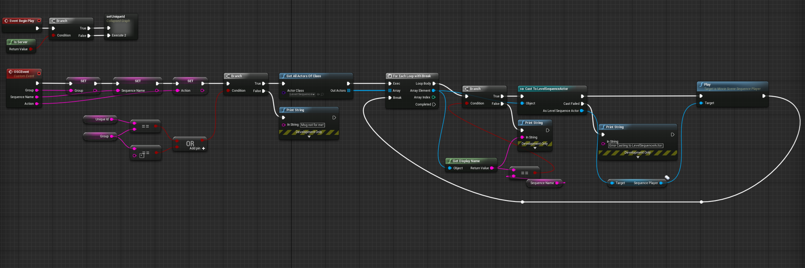

# Unreal-OSC
OSC Cueing control system example for Unreal

## Requirements
Tested on Mac running Unreal 4.21

## Usage
Send OSC messages (via e.g. Qlab) to the machine acting as a server using port 8060. OSC messages should use the format:
```
/HighCastle/<group>/<sequenceName>/<action> 100
```
where `<group>` is a specific tag, `sequenceName` is the name of the Level Sequence in Unreal, and `action` is the sequencer function to perform.

For this example, the server is assigned to the `grasshopper` group and all others are `unmodded`. Two level sequences exist (`SQ_OSC_1` & `SQ_OSC_2`), and the only action is  `go` to start the sequence. To send to everyone, us `*` for the group.

## Functionality
All the logic is found in the Blueprint Class  `BP_OSC` and the attached Blueprint Actor Component `BP_OSC_Sequencer`.


### BP_OSC
* Listens on port 8060 for OSC messages and parses message
* Replicated -> send OSC messages to server and it will be replicated to all clients



### BP_OSC_Sequencer
* Component attached to BP_OSC
* Listens for parsed message, decides if it’s relevant, plays sequence 

## Notes
* By default, Unreal will reset all properties of the objects involved in a sequence once it is completed. This can be changed on a per-actor basis in the sequencer editor; there’s no way to change this default in the Unreal editor. To set it to “Keep State” by default, you can add this to your DefaultEngine.ini file:
```
[/Script/LevelSequence.LevelSequence]
 DefaultCompletionMode=KeepState
```

* To change the listening port for OSC messages, go to Project Settings -> OSC (under Plugins) -> Change `Receive From` port


